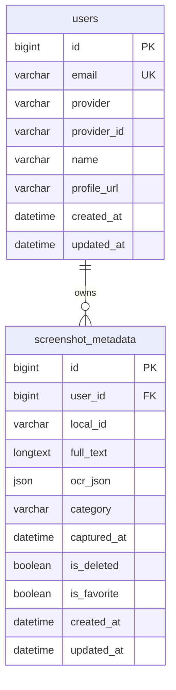

# 06. 데이터베이스 스키마 (Database Schema)

> AWS RDS MySQL 테이블 설계 및 인덱스 전략

---

## 1. ERD (Entity Relationship Diagram)

```
┌─────────────────────────────────────────────────────────────────────────┐
│                                                                          │
│    ┌──────────────────┐         ┌──────────────────────────────────┐   │
│    │      users       │         │       screenshot_metadata         │   │
│    ├──────────────────┤         ├──────────────────────────────────┤   │
│    │ PK  id           │────┐    │ PK  id                           │   │
│    │     email        │    │    │ FK  user_id                      │   │
│    │     provider     │    └───▶│     local_id                     │   │
│    │     provider_id  │         │     full_text                    │   │
│    │     name         │         │     ocr_json                     │   │
│    │     profile_url  │         │     category                     │   │
│    │     created_at   │         │     captured_at                  │   │
│    │     updated_at   │         │     is_deleted                   │   │
│    └──────────────────┘         │     is_favorite                  │   │
│                                 │     created_at                   │   │
│                                 │     updated_at                   │   │
│                                 └──────────────────────────────────┘   │
│                                                                          │
└─────────────────────────────────────────────────────────────────────────┘
```

**Mermaid 다이어그램:**



---

## 2. 테이블 상세 정의

### 2.1 users (사용자)

소셜 로그인 사용자 정보를 저장합니다.

```sql
CREATE TABLE users (
    id BIGINT PRIMARY KEY AUTO_INCREMENT,
    email VARCHAR(255) NOT NULL UNIQUE,
    provider VARCHAR(50) NOT NULL COMMENT 'GOOGLE, APPLE',
    provider_id VARCHAR(255) NOT NULL COMMENT '소셜 로그인 고유 ID',
    name VARCHAR(100),
    profile_url VARCHAR(500),
    created_at DATETIME DEFAULT CURRENT_TIMESTAMP,
    updated_at DATETIME DEFAULT CURRENT_TIMESTAMP ON UPDATE CURRENT_TIMESTAMP,

    UNIQUE KEY uk_provider_id (provider, provider_id)
) ENGINE=InnoDB DEFAULT CHARSET=utf8mb4 COLLATE=utf8mb4_unicode_ci;
```

| 필드명 | 타입 | 제약조건 | 설명 |
| --- | --- | --- | --- |
| `id` | BIGINT | PK, AUTO_INCREMENT | 내부 사용자 ID |
| `email` | VARCHAR(255) | NOT NULL, UNIQUE | 이메일 주소 |
| `provider` | VARCHAR(50) | NOT NULL | 소셜 로그인 제공자 (GOOGLE, APPLE) |
| `provider_id` | VARCHAR(255) | NOT NULL | 소셜 로그인 고유 식별자 |
| `name` | VARCHAR(100) | NULL | 사용자 이름 |
| `profile_url` | VARCHAR(500) | NULL | 프로필 이미지 URL |
| `created_at` | DATETIME | DEFAULT NOW | 생성 시각 |
| `updated_at` | DATETIME | ON UPDATE NOW | 수정 시각 |

---

### 2.2 screenshot_metadata (스크린샷 메타데이터)

OCR 분석 결과 및 분류 정보를 저장합니다.

```sql
CREATE TABLE screenshot_metadata (
    id BIGINT PRIMARY KEY AUTO_INCREMENT,
    user_id BIGINT NOT NULL,
    local_id VARCHAR(255) NOT NULL COMMENT '클라이언트 AssetEntity.id',
    full_text LONGTEXT COMMENT '전체 OCR 텍스트 (검색용)',
    ocr_json JSON COMMENT '텍스트 블록별 좌표 정보',
    category VARCHAR(50) DEFAULT 'OTHER' COMMENT 'FINANCE, SHOPPING, SCHEDULE, HUMOR, OTHER',
    captured_at DATETIME COMMENT '스크린샷 촬영 시각',
    is_deleted BOOLEAN DEFAULT FALSE COMMENT '삭제 여부 (Soft Delete)',
    is_favorite BOOLEAN DEFAULT FALSE COMMENT '즐겨찾기 여부',
    created_at DATETIME DEFAULT CURRENT_TIMESTAMP,
    updated_at DATETIME DEFAULT CURRENT_TIMESTAMP ON UPDATE CURRENT_TIMESTAMP,

    -- 인덱스
    FULLTEXT INDEX ft_full_text (full_text),
    INDEX idx_user_category_captured (user_id, category, captured_at DESC),
    INDEX idx_user_deleted (user_id, is_deleted),
    UNIQUE KEY uk_user_local (user_id, local_id),

    -- 외래 키
    CONSTRAINT fk_user FOREIGN KEY (user_id) REFERENCES users(id) ON DELETE CASCADE
) ENGINE=InnoDB DEFAULT CHARSET=utf8mb4 COLLATE=utf8mb4_unicode_ci;
```

| 필드명 | 타입 | 제약조건 | 설명 |
| --- | --- | --- | --- |
| `id` | BIGINT | PK, AUTO_INCREMENT | 내부 메타데이터 ID |
| `user_id` | BIGINT | NOT NULL, FK | 소유자 사용자 ID |
| `local_id` | VARCHAR(255) | NOT NULL | 클라이언트의 AssetEntity.id |
| `full_text` | LONGTEXT | NULL | 전체 OCR 텍스트 (검색 대상) |
| `ocr_json` | JSON | NULL | 텍스트 블록별 좌표 정보 |
| `category` | VARCHAR(50) | DEFAULT 'OTHER' | 자동 분류 카테고리 |
| `captured_at` | DATETIME | NULL | 스크린샷 촬영 시각 |
| `is_deleted` | BOOLEAN | DEFAULT FALSE | Soft Delete 플래그 |
| `is_favorite` | BOOLEAN | DEFAULT FALSE | 즐겨찾기 플래그 |
| `created_at` | DATETIME | DEFAULT NOW | 생성 시각 |
| `updated_at` | DATETIME | ON UPDATE NOW | 수정 시각 |

---

## 3. 카테고리 ENUM

```sql
-- Java Enum으로 관리
public enum Category {
    FINANCE,    // 금융 (입금, 출금, 잔액 등)
    SHOPPING,   // 쇼핑 (배송, 주문, 결제 등)
    SCHEDULE,   // 일정 (약속, 예약, 날짜 등)
    HUMOR,      // 유머 (ㅋㅋ, ㅎㅎ 등)
    OTHER       // 기타 (분류 불가)
}
```

---

## 4. JSON 필드 상세

### 4.1 ocr_json 구조

```json
[
  {
    "text": "스타벅스",
    "rect": {
      "x": 100,
      "y": 200,
      "w": 80,
      "h": 25
    }
  },
  {
    "text": "아메리카노",
    "rect": {
      "x": 100,
      "y": 240,
      "w": 100,
      "h": 25
    }
  },
  {
    "text": "4,500원",
    "rect": {
      "x": 100,
      "y": 280,
      "w": 60,
      "h": 20
    }
  }
]
```

| 필드 | 타입 | 설명 |
| --- | --- | --- |
| `text` | String | 인식된 텍스트 |
| `rect.x` | Integer | 좌측 시작점 (px) |
| `rect.y` | Integer | 상단 시작점 (px) |
| `rect.w` | Integer | 너비 (px) |
| `rect.h` | Integer | 높이 (px) |

### 4.2 JSON 쿼리 예시

```sql
-- 특정 텍스트가 포함된 블록 찾기
SELECT id, local_id,
       JSON_EXTRACT(ocr_json, '$[*].text') AS texts
FROM screenshot_metadata
WHERE user_id = 1
  AND JSON_SEARCH(ocr_json, 'one', '%스타벅스%') IS NOT NULL;
```

---

## 5. 인덱스 전략

### 5.1 인덱스 목록

| 인덱스명 | 대상 컬럼 | 용도 |
| --- | --- | --- |
| `PRIMARY` | id | 기본 키 |
| `ft_full_text` | full_text | Full-Text 검색 |
| `idx_user_category_captured` | (user_id, category, captured_at DESC) | 카테고리별 목록 조회 |
| `idx_user_deleted` | (user_id, is_deleted) | 삭제되지 않은 항목 필터 |
| `uk_user_local` | (user_id, local_id) | 중복 동기화 방지 |

### 5.2 Full-Text Index 설정

```sql
-- Full-Text 검색 쿼리
SELECT id, local_id, full_text, category, captured_at
FROM screenshot_metadata
WHERE user_id = :userId
  AND is_deleted = FALSE
  AND MATCH(full_text) AGAINST(:searchTerm IN NATURAL LANGUAGE MODE)
ORDER BY captured_at DESC
LIMIT 50;
```

**Full-Text 설정 옵션:**

```sql
-- MySQL 설정 (my.cnf)
[mysqld]
# 최소 검색어 길이 (기본값: 4 → 2로 변경)
ft_min_word_len = 2
innodb_ft_min_token_size = 2

# 한글 형태소 분석기 (ngram)
ngram_token_size = 2
```

### 5.3 복합 인덱스 활용

```sql
-- 카테고리별 최신순 조회 (인덱스 활용)
SELECT id, local_id, category, captured_at
FROM screenshot_metadata
WHERE user_id = 1
  AND category = 'SHOPPING'
  AND is_deleted = FALSE
ORDER BY captured_at DESC
LIMIT 30;

-- EXPLAIN 결과: Using index condition
```

---

## 6. 쿼리 예시

### 6.1 동기화 (Upsert)

```sql
INSERT INTO screenshot_metadata
    (user_id, local_id, full_text, ocr_json, category, captured_at)
VALUES
    (:userId, :localId, :fullText, :ocrJson, :category, :capturedAt)
ON DUPLICATE KEY UPDATE
    full_text = VALUES(full_text),
    ocr_json = VALUES(ocr_json),
    category = VALUES(category),
    updated_at = CURRENT_TIMESTAMP;
```

### 6.2 검색

```sql
SELECT
    id,
    local_id,
    full_text,
    ocr_json,
    category,
    captured_at
FROM screenshot_metadata
WHERE user_id = :userId
  AND is_deleted = FALSE
  AND MATCH(full_text) AGAINST(:searchTerm IN NATURAL LANGUAGE MODE)
ORDER BY captured_at DESC
LIMIT :limit OFFSET :offset;
```

### 6.3 카테고리별 조회

```sql
SELECT
    id,
    local_id,
    category,
    captured_at
FROM screenshot_metadata
WHERE user_id = :userId
  AND is_deleted = FALSE
  AND (:category IS NULL OR category = :category)
ORDER BY captured_at DESC
LIMIT :limit OFFSET :offset;
```

### 6.4 Soft Delete

```sql
UPDATE screenshot_metadata
SET is_deleted = TRUE,
    updated_at = CURRENT_TIMESTAMP
WHERE user_id = :userId
  AND local_id = :localId;
```

### 6.5 통계 (카테고리별 개수)

```sql
SELECT category, COUNT(*) AS count
FROM screenshot_metadata
WHERE user_id = :userId
  AND is_deleted = FALSE
GROUP BY category;
```

---

## 7. 마이그레이션 전략

### 7.1 초기 마이그레이션

```sql
-- V1__create_users_table.sql
CREATE TABLE users (...);

-- V2__create_screenshot_metadata_table.sql
CREATE TABLE screenshot_metadata (...);
```

### 7.2 향후 확장 (Optional)

```sql
-- V3__add_tags_table.sql (향후 태그 기능 추가 시)
CREATE TABLE tags (
    id BIGINT PRIMARY KEY AUTO_INCREMENT,
    screenshot_id BIGINT NOT NULL,
    tag_name VARCHAR(50) NOT NULL,
    created_at DATETIME DEFAULT CURRENT_TIMESTAMP,

    FOREIGN KEY (screenshot_id) REFERENCES screenshot_metadata(id) ON DELETE CASCADE,
    INDEX idx_tag_name (tag_name)
);
```

---

## 8. 참고 문서

- [02-ARCHITECTURE.md](./02-ARCHITECTURE.md) - 시스템 아키텍처
- [03-TECH_STACK.md](./03-TECH_STACK.md) - 기술 스택
